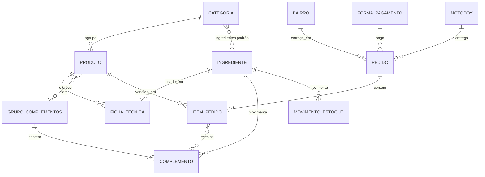

# Komanda — Levantamento de requisitos

Projeto de Desenvolvimento 1 · 23/09/2026 · Gabriel Lessa Tramasol Machado

## Visão geral

O Komanda é um sistema de gestão para lancheria com entrega (delivery). Ele cobre o cardápio, os pedidos com cálculo automático, o estoque de insumos, o acerto dos motoboys, o fechamento de caixa e um dashboard de vendas para o gestor.

| Perfil | O que faz no sistema |
| --- | --- |
| Atendente | Registra pedidos, endereços e forma de pagamento; mantém cardápio, estoque, bairros, motoboys e formas de pagamento; faz o fechamento de caixa |
| Gestor | Faz tudo o que o atendente faz e, com a credencial de gestor, abre o dashboard |
| Motoboy | Não usa o sistema; só tem o nome cadastrado para atribuir os pedidos que entregou e fazer o acerto no fim da noite |

Não há usuários diferentes: o sistema tem um único login e a mesma tela para todos. A diferença é a aba do dashboard, que pede uma credencial específica ao ser clicada, e só o gestor tem essa credencial. O cliente não acessa o sistema e, neste MVP, não há cadastro de clientes.

## Cardápio e produtos

O cardápio segue o padrão do iFood e da Anota AI: categoria → produto → grupos de complementos. Não há um cadastro separado de "tipo"; a categoria já cumpre esse papel.

| Nível | Exemplo | O que define |
| --- | --- | --- |
| Categoria | Xis, Bauru, Hambúrguer, Cachorro-quente, Bebidas | Agrupa os produtos no cardápio e guarda os ingredientes padrão |
| Produto | Xis Carne, Xis Coração, Xis Frango | Preço de venda e ficha técnica |
| Grupo de complementos | "Adicionais", "Retirar ingredientes" | Se é obrigatório ou opcional e quantas opções o atendente pode marcar (mínimo e máximo) |
| Complemento | Bacon extra (+R$ 4), Sem tomate (R$ 0) | Preço extra e quanto consome do estoque |

- **Requisito 1 — Cadastrar categorias:** criar, editar e desativar categorias e definir a ordem em que aparecem.
- **Requisito 2 — Cadastrar ingredientes:** nome, unidade de medida (unidade ou kg) e estoque mínimo fixo. O mesmo cadastro alimenta o estoque.
- **Requisito 3 — Ingredientes padrão da categoria:** definir os ingredientes comuns da categoria (ex.: alface e tomate no Xis). Ao criar um produto, eles já vêm preenchidos na ficha técnica e podem ser ajustados.
- **Requisito 4 — Cadastrar produtos:** nome, categoria, descrição, preço e ativo/inativo.
- **Requisito 5 — Ficha técnica do produto:** quantidade média de cada ingrediente por unidade vendida, com a unidade de medida escolhida. O padrão é unidade (un), com opção de gramas (g) ou quilogramas (kg). Exemplos: Refrigerante lata leva 1 un; Xis Filé leva em média 220 g de carne.
- **Requisito 6 — Cadastrar grupos de complementos:** nome, se é obrigatório ou opcional, e quantidade mínima e máxima de escolhas. Um grupo pode ser ligado a vários produtos (ex.: "Adicionais" em todos os Xis).
- **Requisito 7 — Cadastrar complementos:** nome, preço extra (R$ 0 quando só retira um ingrediente) e o ingrediente e a quantidade que soma ou desconta do estoque.
- **Requisito 8 — Listar o cardápio:** produtos ativos agrupados por categoria, com preço.

## Pedidos, entrega e pagamento

O pedido junta produtos, endereço e forma de pagamento. O total se calcula sozinho: itens e adicionais, mais a taxa do bairro quando é entrega.

**Pedidos**

- **Requisito 9 — Cadastrar pedido:** adicionar produtos do cardápio e informar a quantidade de cada um.
- **Requisito 10 — Tipo de pedido:** entrega ou retirada no balcão. Na retirada não há endereço, taxa nem motoboy.
- **Requisito 11 — Personalizar o item:** tirar ingredientes (ex.: sem tomate) e incluir adicionais pagos. Os adicionais somam no preço do item; tirar e adicionar ajustam a baixa de estoque.
- **Requisito 12 — Adicionais no pedido:** são os complementos cadastrados no cardápio (Requisitos 6 e 7), oferecidos no pedido conforme os grupos ligados ao produto.
- **Requisito 13 — Soma automática:** o subtotal de cada item (preço × quantidade + adicionais) e o total do pedido atualizam a cada item incluído ou removido.
- **Requisito 14 — Endereço de entrega:** rua, número, complemento, referência e bairro (só em entregas).
- **Requisito 15 — Taxa de entrega automática:** ao escolher o bairro, a taxa daquele bairro entra no total do pedido.
- **Requisito 16 — Forma de pagamento:** escolher a forma de pagamento do pedido. Em dinheiro, informar o valor recebido e o sistema calcula o troco.
- **Requisito 17 — Vincular motoboy:** indicar qual motoboy fez a entrega.
- **Requisito 18 — Status do pedido:** Em preparo (assim que o pedido é registrado), Saiu para entrega, Entregue e Cancelado. Na retirada, o pedido vai de Em preparo direto para Entregue.

**Bairros**

- **Requisito 19 — Cadastrar bairros:** nome do bairro e valor da taxa de entrega.

**Formas de pagamento**

- **Requisito 20 — Cadastrar formas de pagamento:** PIX, cartão de crédito, cartão de débito e dinheiro, com opção de incluir outras depois.

**Prazo médio de entrega**

- **Requisito 21 — Ajustar o prazo médio de entrega:** campo sempre visível na tela de pedidos (ex.: "40 min"), que o atendente altera com um clique conforme o movimento, sem sair da tela.
- **Requisito 22 — Prazo no pedido:** cada pedido novo grava o prazo vigente e mostra a previsão de entrega (hora do pedido + prazo), para o atendente informar ao cliente.

## Estoque e motoboys

O estoque controla os ingredientes (insumos): entra pelo cadastro de entrada e sai sozinho a cada pedido, pela ficha técnica.

**Estoque**

- **Requisito 23 — Registrar entrada de estoque:** ingrediente, categoria, quantidade recebida, unidade de medida (unidade ou kg) e data.
- **Requisito 24 — Baixa automática por pedido:** ao fechar um pedido, o sistema desconta de cada ingrediente a quantidade da ficha técnica multiplicada pela quantidade vendida.
- **Requisito 25 — Consultar saldo:** ver a quantidade atual de cada ingrediente e o histórico de entradas e saídas.

**Motoboys**

- **Requisito 26 — Cadastrar motoboy:** nome e valor fixo por noite. O ganho por entrega é a taxa inteira do bairro da entrega.
- **Requisito 27 — Acerto do motoboy:** no fim da noite, mostrar quanto cada motoboy recebe: valor fixo + soma das taxas dos bairros das entregas que fez.

## Fechamento de caixa e dashboard

São duas telas: o fechamento do caixa do dia e o dashboard do gestor com métricas filtráveis por período.

**Fechamento de caixa do dia**

- **Requisito 28 — Fechar o caixa:** total de pedidos e de vendas do dia, separado por forma de pagamento.
- **Requisito 29 — Taxas e motoboys no fechamento:** total arrecadado em taxas de entrega e total a pagar para cada motoboy.

**Dashboard do gestor**

- **Requisito 30 — Filtro por período:** dia, semana, mês ou intervalo de datas escolhido.
- **Requisito 31 — Métricas de vendas:**
  - Total vendido e número de pedidos no período
  - Produto mais vendido e menos vendido
  - Categoria (tipo de produto) mais vendida
- **Requisito 32 — Visualização em gráficos:** as métricas aparecem em cards e gráficos no dashboard.
- **Requisito 33 — Aba de alertas de estoque:** lista os ingredientes que estão acabando, para o gestor saber o que comprar para o dia seguinte. O saldo é calculado automaticamente pelas baixas dos pedidos (Regra de negócio 3), sem contagem manual.
  - Cada item mostra o ingrediente, o saldo atual e o estoque mínimo
  - Os itens abaixo do mínimo aparecem primeiro

- **Requisito 34 — Acesso ao dashboard:** a aba do dashboard pede a credencial do gestor antes de abrir.
- **Estoque mínimo do Requisito 33:** valor fixo cadastrado por ingrediente. A previsão pela média de consumo dos últimos dias fica para uma versão futura.

## Regras de negócio

Quatro cálculos são automáticos e nenhum depende de digitação manual de valores.

| Regra | Cálculo |
| --- | --- |
| Regra de negócio 1 — Total do pedido | Soma de (preço do produto × quantidade + adicionais) + taxa do bairro, só em entregas |
| Regra de negócio 2 — Taxa de entrega | Valor cadastrado para o bairro do endereço; muda se o bairro mudar |
| Regra de negócio 3 — Baixa de estoque | Para cada ingrediente da ficha técnica: quantidade média × quantidade vendida, convertendo a unidade quando preciso (ex.: 220 g saem de um estoque em kg como 0,22 kg) |
| Regra de negócio 4 — Acerto do motoboy | Valor fixo da noite + soma das taxas dos bairros das entregas que ele fez |

- **Regra de negócio 5:** o preço do produto fica gravado no pedido. Se o preço mudar depois, os pedidos antigos e os relatórios não mudam.
- **Regra de negócio 6:** o fechamento e o dashboard consideram só pedidos concluídos (status Entregue); pedidos cancelados ficam de fora.

## Entidades principais

Sugestão inicial de modelo de dados para discutirmos; os nomes e campos podem mudar.

| Entidade | Campos principais |
| --- | --- |
| Categoria | nome, ordem, ingredientes padrão, ativo |
| Ingrediente | nome, unidade (un ou kg), saldo atual, estoque mínimo |
| Produto | nome, categoria, descrição, preço, ativo |
| Ficha técnica | produto, ingrediente, quantidade média, unidade de medida (un, g ou kg) |
| Grupo de complementos | nome, obrigatório, mínimo, máximo, produtos ligados |
| Complemento | grupo, nome, preço extra, ingrediente, quantidade (soma ou desconta do estoque) |
| Movimento de estoque | ingrediente, tipo (entrada ou saída), quantidade, data, pedido de origem |
| Pedido | data e hora, tipo (entrega ou retirada), endereço, bairro, taxa, forma de pagamento, valor recebido e troco, motoboy, status, prazo estimado, total |
| Item do pedido | pedido, produto, quantidade, preço unitário gravado, complementos escolhidos, subtotal |
| Bairro | nome, taxa de entrega |
| Forma de pagamento | nome, ativo |
| Motoboy | nome, valor fixo por noite |

## Fontes

Referências usadas para a estrutura do cardápio:

- [Tudo sobre o módulo de cardápio no App do Parceiro — iFood](https://blog-parceiros.ifood.com.br/cardapio-app-do-parceiro/)
- [Cardápio da Anota AI — Central de Ajuda](https://anota.ai/ajuda/cardapio/)
